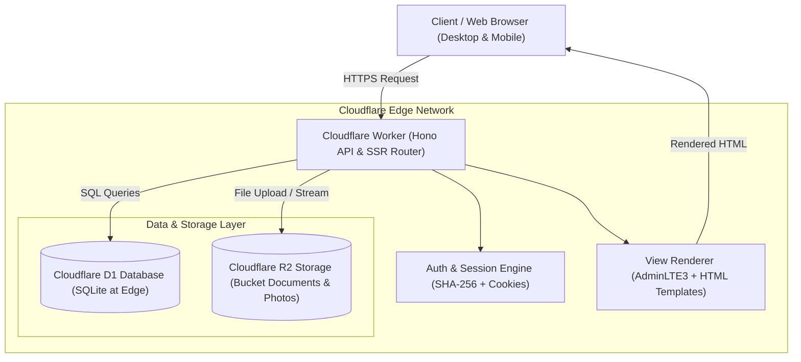
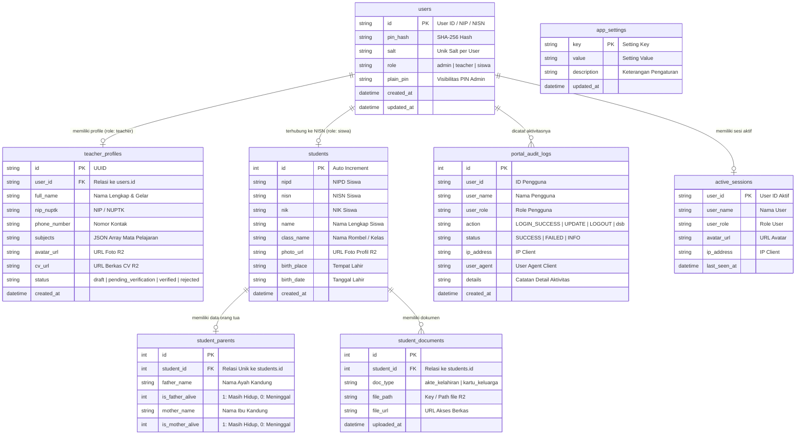
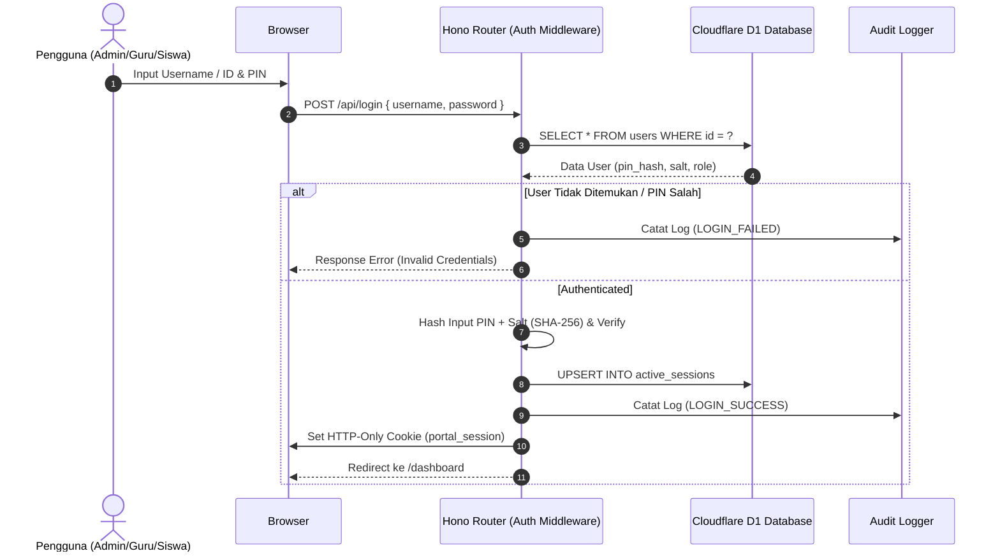
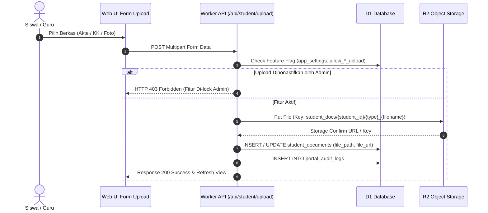
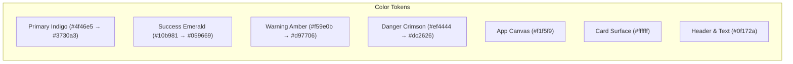
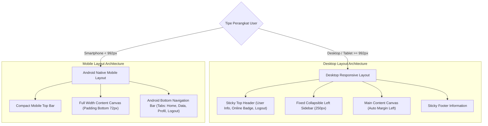
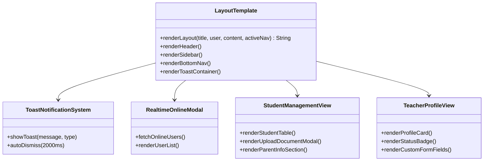
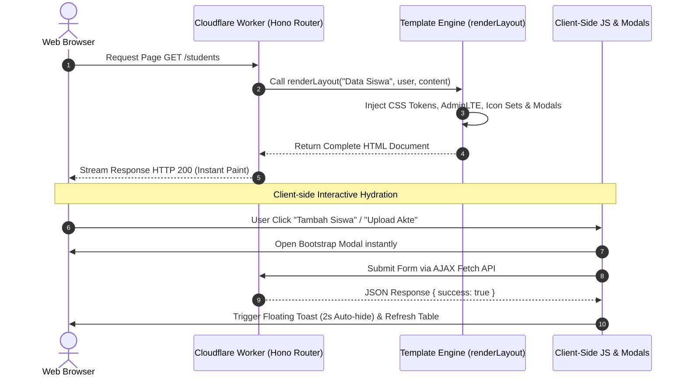
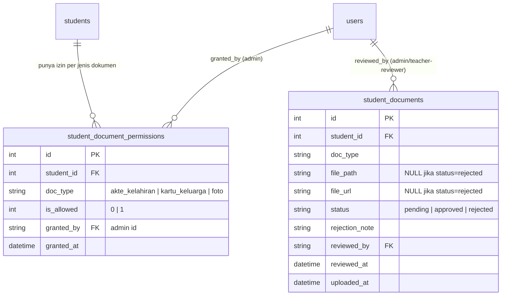
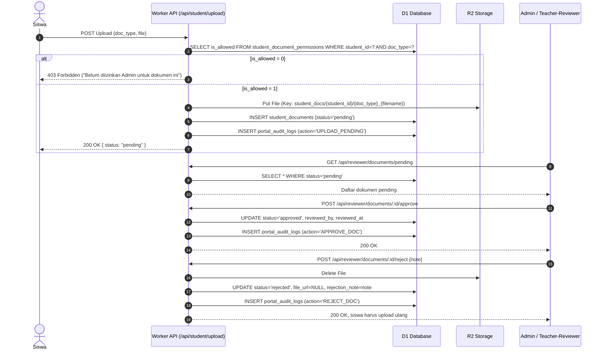

# Document Desain Sistem & Arsitektur - Portal Siswa & Portal Guru Integration

## 1. Ringkasan Eksekutif (Executive Summary)

**Portal Siswa & Portal Guru** adalah aplikasi web manajemen data pendidikan terintegrasi yang dirancang untuk mengelola data siswa, data profil guru/tenaga pendidik, dokumen legal/administrasi siswa, serta menyediakan kontrol penuh untuk Administrator Sekolah.

Sistem ini dibangun di atas infrastruktur serverless berkinerja tinggi **Cloudflare Edge Computing**, memanfaatkan **Cloudflare Workers** sebagai backend runtime, **Cloudflare D1** sebagai database SQL terdistribusi, **Cloudflare R2** sebagai Object Storage untuk berkas/media, serta kerangka kerja **Hono Web Framework** dengan antarmuka **AdminLTE v3** yang disempurnakan dengan Sistem Navigasi Mobile Native Android.

---

## 2. Arsitektur Sistem (High-Level Architecture)

Aplikasi ini menggunakan pola arsitektur serverless terintegrasi penuh pada edge network.



---

## 3. Teknologi & Spesifikasi Perangkat Lunak (Tech Stack)

| Komponen | Teknologi | Deskripsi |
| :--- | :--- | :--- |
| **Runtime Engine** | Cloudflare Workers | Serverless V8 JavaScript/TypeScript execution environment pada Edge |
| **Web Framework** | Hono (`^4.7.0`) | Lightweight, ultra-fast web framework untuk Edge Workers |
| **Database** | Cloudflare D1 | Serverless relational SQL database (SQLite-compatible) |
| **Object Storage** | Cloudflare R2 | S3-compatible Object Storage untuk foto & berkas (Akte, KK, CV) |
| **Frontend Layout** | AdminLTE v3, Bootstrap 5 & Custom CSS Engine | Dasbor Admin & Portal responsif dengan navigasi Mobile Tab Bar |
| **Typography & Icons** | Source Sans 3 & Bootstrap Icons (`^1.11.3`) | Font modern dan icon set lengkap |
| **Bahasa Pemrograman** | TypeScript (`^5.7.3`) | Typed JavaScript untuk keamanan kode dan autocompletion |
| **Pengolahan Data** | SheetJS / XLSX (`^0.18.5`) | Library pendukung impor/ekspor data Excel |
| **Tooling & CLI** | Wrangler (`^3.111.0`) | CLI resmi Cloudflare untuk pengujian lokal (`wrangler dev`) dan deployment |

---

## 4. Model Data & Diagram Hubungan Entitas (ERD)

Sistem menggunakan database relasional Cloudflare D1 dengan 8 tabel utama.



---

## 5. Matriks Peran & Hak Akses (User Roles & Permissions)

Sistem menerapkan **Role-Based Access Control (RBAC)** untuk 3 tingkatan pengguna:

| Modul / Fitur | Admin (`admin`) | Guru (`teacher`) | Siswa (`siswa`) |
| :--- | :---: | :---: | :---: |
| **Login & Session Management** | ✅ Full Access | ✅ Full Access | ✅ Full Access |
| **Lihat Dasbor Statistik** | ✅ Semua Data | ✅ Data Kelas / Umum | ✅ Data Pribadi |
| **Kelola Data Siswa (CRUD)** | ✅ Tambah/Edit/Hapus | 👁️ Lihat Data Kelas | 👁️ Lihat Profil Sendiri |
| **Unggah Dokumen (Akte/KK)** | ✅ Bebas Akses | ❌ Dibatasi | ⚡ Sesuai Feature Flag |
| **Kelola Akun Guru (Profil/Status)**| ✅ Verifikasi/Ubah PIN | ✏️ Edit Profil Sendiri | ❌ Tidak Ada Akses |
| **Audit Logs & Online Users Tracker** | ✅ Akses Penuh | ❌ Tidak Ada Akses | ❌ Tidak Ada Akses |
| **Feature Flags & App Settings** | ✅ Konfigurasi Sistem | ❌ Tidak Ada Akses | ❌ Tidak Ada Akses |

---

## 6. Alur Kerja Utama Sistem (System Workflows)

### 6.1 Alur Autentikasi & Keamanan Sesi



### 6.2 Alur Pengunggahan Dokumen Siswa ke Cloudflare R2



---

## 7. Desain & Arsitektur Antarmuka Frontend (Frontend UI/UX Architecture)

### 7.1 Sistem Desain & Token Warna (Design System & Color Tokens)

Frontend menggunakan skema warna **High-Contrast Light Mode** dengan gradien modern yang konsisten, kontras tinggi, dan ramah pembaca pada berbagai resolusi layar.



* **Canvas & Surface**: Background aplikasi menggunakan slate `#f1f5f9`, dengan kontainer kartu `#ffffff` berlatar batas tegas `#cbd5e1` dan bayangan lembut `0 4px 16px rgba(15, 23, 42, 0.05)`.
* **Tipografi**: Font family **Source Sans 3**, diatur dengan aturan kontras tinggi `color-scheme: light !important` untuk mencegah warna teks memudar saat perangkat menggunakan mode gelap otomatis OS.
* **Badges & Tombol Status**:
  - `Primary` (`#4f46e5`): Tombol utama & indikator aktif.
  - `Success` (`#059669`): Status verifikasi `verified` & modal online real-time.
  - `Warning` (`#d97706`): Status `pending_verification` & peringatan system flags.
  - `Danger` (`#dc2626`): Tombol logout, penghapusan data & status `rejected`.

---

### 7.2 Struktur Tata Letak Responsif & Adaptif (Adaptive Layout System)

Tampilan frontend menyesuaikan diri secara otomatis berdasarkan perangkat yang digunakan:



#### A. Layout Desktop (>= 992px)
* **Sidebar Kiri Terpaku (Fixed Sidebar 250px)**: Warna `#0f172a` dengan efek *smooth collapse* saat tombol ☰ diklik.
* **Sticky Top Navbar**: Menyediakan informasi pengguna aktif, indikator status online real-time (*pulse indicator*), avatar profil, dan tombol eksplisit **Logout**.

#### B. Layout Mobile Android Native (< 992px)
* **Penyembunyian Sidebar Kiri**: Sidebar kiri disembunyikan secara otomatis agar tidak memakan ruang layar ponsel yang terbatas.
* **Android Bottom Navigation Bar (Tabs Bar)**: Menggantikan navigasi sidebar dengan 4-5 tab utama di bagian bawah layar (Home, Data Siswa/Guru, Profil, & Logout) dengan icon intuitif dan efek transisi haptik visual.
* **Tabel & Kartu Ringkas**: Tabel otomatis mendukung *touch horizontal scroll*, ukuran font disesuaikan menjadi `0.85rem`, dan kartu dibuat lebih compact dengan sudut membulat 14px.

---

### 7.3 Komponen Antarmuka Utama (Key UI Components)



#### 1. Floating Toast Notification Engine
* Terletak di pojok kanan bawah (`.app-toast-container`).
* Mendukung 4 varian pesan: `info`, `success`, `warning`, `danger`.
* Dilengkapi efek animasi *scale-in* (`translateY(0) scale(1)`) dan *auto-dismiss* otomatis dalam waktu 2 detik tanpa mengganggu navigasi pengguna.

#### 2. Modal Real-Time User Tracker
* Menampilkan daftar seluruh pengguna (Admin, Guru, Siswa) yang sedang online secara langsung.
* Dilengkapi *pulse animation spinner* hijau pada navbar sebagai penanda aktivitas real-time.

#### 3. Modul Formulir & Unggah Dokumen Siswa
* Kartu unggah terpisah untuk **Foto Profil**, **Akte Kelahiran**, dan **Kartu Keluarga**.
* Menyediakan indikator berkas terunggah (*preview link* & tanggal unggah) serta penanganan validasi *feature flag* (apabila Admin mematikan opsi unggah).

#### 4. Kartu Profil & Verifikasi Guru
* Menampilkan informasi lengkap NIP/NUPTK, bidang studi (mata pelajaran), nomor kontak, berkas CV, serta badge status verifikasi (`draft`, `pending_verification`, `verified`, `rejected`).

---

### 7.4 Alur Renderer Frontend (Server-Side Rendering + Dynamic Hydration)



---

## 8. Keamanan & Kepatuhan Data (Security Design)

1. **Enkripsi Kredensial**:
   - Kata sandi/PIN disimpan dalam bentuk Hashing **SHA-256** ditambah **Salt** unik per pengguna.
   - Menyediakan visibilitas `plain_pin` khusus untuk keperluan pemulihan cepat oleh Administrator Sekolah.
2. **Keamanan Cookie Sesi**:
   - Cookie sesi `portal_session` dienkripsi dengan standar Safe Base64 Encoding.
   - Ditandai dengan atribut `HttpOnly` untuk mencegah serangan Cross-Site Scripting (XSS).
3. **Auditability (Jejak Audit)**:
   - Setiap tindakan penting (`LOGIN_SUCCESS`, `LOGIN_FAILED`, `LOGOUT`, `UPDATE_DATA`, `UPLOAD_DOC`) dicatat secara otomatis ke dalam `portal_audit_logs` bersama alamat IP dan User-Agent client.
4. **Real-time Session Monitoring**:
   - Pelacakan aktif pengguna secara *real-time* via tabel `active_sessions` untuk memantau pengguna yang sedang aktif di portal.
5. **Feature Flagging (Pengontrol Fitur)**:
   - Pengaturan fitur unggah foto, Akte, dan KK dapat dikunci atau dibuka secara dinamis melalui tabel `app_settings` oleh Admin.

---

## 9. Panduan Pengembangan & Deployment (Operations Guide)

### 9.1 Lingkungan Pengujian Lokal (Development)
```bash
# 1. Jalankan server pengembang lokal
npm run dev

# 2. Inisialisasi Database D1 Lokal dengan schema.sql
npm run db:init
```

### 9.2 Deployment ke Produksi (Production Deployment)
```bash
# 1. Inisialisasi / Migrasi Database D1 di Cloudflare Remote
npm run db:init:prod

# 2. Deploy Cloudflare Worker ke Edge Network
npm run deploy
```

---

## 10. Kesimpulan & Pengembangan Selanjutnya

Dokumen desain ini menjadi panduan arsitektur utama untuk pengemasan, pemeliharaan, serta skalabilitas **Portal Siswa & Portal Guru Integration**, baik di sisi backend serverless maupun antarmuka frontend yang adaptif. Dengan kombinasi infrastruktur terdistribusi Cloudflare Edge dan desain antarmuka responsif seluler Android Native, sistem menjamin latensi rendah, ketersediaan tinggi, pengalaman pengguna yang intuitif, serta keamanan data pendidikan yang terjamin.

---

# Adendum: Granular Document Permission & Approval Workflow
### Portal Siswa & Portal Guru Integration

> Dokumen ini adalah **adendum** dari `Design.md` (Document Desain Sistem & Arsitektur - Portal Siswa & Portal Guru Integration). Adendum ini memperluas §5 (Matriks Peran & Hak Akses), §6.2 (Alur Pengunggahan Dokumen), dan §4 (Model Data / ERD) pada dokumen utama untuk mendukung kontrol izin dokumen yang lebih granular.

---

## 1. Latar Belakang & Tujuan

Desain awal sistem (`Design.md` §5) menggunakan **feature flag global** (`app_settings: allow_*_upload`) untuk membuka/menutup fitur unggah dokumen bagi seluruh siswa sekaligus. Adendum ini mengubah pendekatan tersebut menjadi kontrol **per-siswa dan per-jenis-dokumen**, ditambah alur **approval wajib** sebelum dokumen dianggap sah, serta kemampuan **Admin mendelegasikan wewenang approval ke Teacher tertentu**.

Ringkasan keputusan desain:
| Aspek | Keputusan |
|---|---|
| Granularitas izin upload | Per siswa **dan** per jenis dokumen (bukan satu izin untuk semua) |
| Approval dokumen | Wajib — dokumen berstatus `pending` sampai direview |
| Siapa yang bisa approve | Admin selalu bisa; Teacher hanya bisa jika ditetapkan sebagai *Document Reviewer* oleh Admin |
| Dokumen yang di-*reject* | File dihapus permanen dari R2; siswa upload ulang dari awal |
| Batas waktu approval (SLA) | Tidak ada — dokumen bisa menunggu di `pending` tanpa batas waktu |
| Audit trail | Tetap tersimpan di `portal_audit_logs` meski file fisik sudah dihapus |

---

## 2. Peran Pengguna (Diperluas dari §5)

1. **Admin** — kontrol mutlak:
   - Menetapkan role pengguna (`admin` / `teacher` / `siswa`)
   - Mencentang izin upload per siswa **per jenis dokumen** (Kartu Keluarga / Akte Kelahiran / Foto)
   - Menetapkan Teacher mana yang menjadi **Document Reviewer**
   - Approve/reject dokumen kapan saja
2. **Teacher** —
   - **Reviewer = false** (default): tidak punya akses ke dashboard approval sama sekali
   - **Reviewer = true** (di-set Admin): dapat approve/reject dokumen siswa yang berstatus `pending`
3. **Siswa** — hanya dapat mengunggah dokumen untuk jenis yang izinnya aktif (`is_allowed = 1`); status dokumen terlihat sebagai `Pending` / `Approved` / `Rejected`

---

## 3. Perubahan Skema Database (D1)

### 3.1 Tabel Baru: `student_document_permissions`

Menggantikan pendekatan flag global dengan kontrol granular per baris siswa × jenis dokumen.

```sql
CREATE TABLE student_document_permissions (
  id INTEGER PRIMARY KEY AUTOINCREMENT,
  student_id INTEGER NOT NULL REFERENCES students(id),
  doc_type TEXT NOT NULL CHECK(doc_type IN ('akte_kelahiran','kartu_keluarga','foto')),
  is_allowed INTEGER NOT NULL DEFAULT 0,       -- 0 = tidak diizinkan, 1 = diizinkan
  granted_by TEXT REFERENCES users(id),        -- admin id yang mencentang
  granted_at DATETIME,
  UNIQUE(student_id, doc_type)
);
```

### 3.2 Perluasan Tabel `users` (delegasi reviewer)

```sql
ALTER TABLE users ADD COLUMN is_document_reviewer INTEGER DEFAULT 0;
-- Hanya relevan untuk role = 'teacher'; di-set oleh Admin
```

### 3.3 Perluasan Tabel `student_documents` (status approval)

```sql
ALTER TABLE student_documents ADD COLUMN status TEXT DEFAULT 'pending'
  CHECK(status IN ('pending','approved','rejected'));
ALTER TABLE student_documents ADD COLUMN rejection_note TEXT;
ALTER TABLE student_documents ADD COLUMN reviewed_by TEXT REFERENCES users(id);
ALTER TABLE student_documents ADD COLUMN reviewed_at DATETIME;
```

> Saat `status = 'rejected'`: `file_path` dan `file_url` di-set `NULL`, file fisik dihapus dari R2 (`R2.delete()`). Riwayat aksi tetap tersimpan di `portal_audit_logs`, bukan di tabel dokumen itu sendiri.

### 3.4 ERD Tambahan (pelengkap §4 di Design.md)



---

## 4. Alur Kerja (Menggantikan §6.2 di Design.md)



---

## 5. Matriks Peran & Hak Akses (Perluasan §5 di Design.md)

| Modul / Fitur | Admin | Teacher (Reviewer = false) | Teacher (Reviewer = true) | Siswa |
| :--- | :---: | :---: | :---: | :---: |
| Set izin upload per jenis dokumen per siswa | ✅ | ❌ | ❌ | ❌ |
| Set status `is_document_reviewer` pada Teacher | ✅ | ❌ | ❌ | ❌ |
| Lihat dashboard dokumen `pending` | ✅ Semua | ❌ | ✅ | ❌ |
| Approve / Reject dokumen | ✅ | ❌ | ✅ | ❌ |
| Upload dokumen (sesuai izin aktif) | ➖ | ➖ | ➖ | ⚡ |
| Lihat status dokumen sendiri (`Pending`/`Approved`/`Rejected`) | ➖ | ➖ | ➖ | ✅ |

---

## 6. Endpoint API Baru (pola Hono, melengkapi Worker API)

| Method | Endpoint | Deskripsi | Akses |
|---|---|---|---|
| `GET` | `/api/admin/students/:id/permissions` | Lihat status izin per jenis dokumen untuk 1 siswa | Admin |
| `PUT` | `/api/admin/students/:id/permissions` | Set/ubah izin per jenis dokumen (checkbox) | Admin |
| `PUT` | `/api/admin/teachers/:id/reviewer` | Toggle `is_document_reviewer` pada Teacher | Admin |
| `GET` | `/api/reviewer/documents/pending` | Daftar dokumen berstatus `pending` | Admin, Teacher-Reviewer |
| `POST` | `/api/reviewer/documents/:id/approve` | Setujui dokumen | Admin, Teacher-Reviewer |
| `POST` | `/api/reviewer/documents/:id/reject` | Tolak dokumen (hapus file R2 + catat alasan) | Admin, Teacher-Reviewer |
| `POST` | `/api/student/upload` | Upload dokumen (dicek terhadap `student_document_permissions`) | Siswa |

Semua endpoint di atas wajib menulis ke `portal_audit_logs` (mengikuti pola audit yang sudah ada di §8 Design.md), dengan `action` baru: `SET_PERMISSION`, `SET_REVIEWER`, `UPLOAD_PENDING`, `APPROVE_DOC`, `REJECT_DOC`.

---

## 7. Perubahan Komponen UI (melengkapi §7.3 di Design.md)

- **`StudentManagementView`** — tambah `renderDocumentPermissionCheckboxes()`: 3 checkbox (KK / Akte / Foto) per baris siswa di tabel manajemen.
- **Komponen baru: `DocumentReviewDashboard`**
  - `renderPendingDocumentsQueue()` — daftar dokumen `pending`, terlihat oleh Admin (semua) dan Teacher-Reviewer.
  - `renderApproveRejectModal()` — modal aksi approve/reject, dengan field `rejectionNote` wajib diisi saat reject.
- **`TeacherProfileView`** (khusus tampilan Admin) — tambah toggle switch **"Jadikan Document Reviewer"** pada kartu profil guru.
- Status dokumen di sisi siswa memakai badge warna sesuai token desain yang sudah ada (§7.1): `Pending` → Warning (`#d97706`), `Approved` → Success (`#059669`), `Rejected` → Danger (`#dc2626`).

---

## 8. Catatan Implementasi

- Query permission harus dicek di **setiap** request upload (bukan hanya di render UI), untuk mencegah bypass lewat API langsung.
- Reject harus bersifat atomik: hapus file R2 dan update baris DB dalam satu alur — jika penghapusan R2 gagal, status jangan berubah jadi `rejected` agar tidak terjadi data yatim (`file_url` menunjuk file yang masih ada padahal status sudah rejected, atau sebaliknya).
- Karena tidak ada SLA, pertimbangkan indikator visual "sudah menunggu berapa lama" di dashboard reviewer (opsional, tidak fungsional wajib) agar dokumen lama tidak terlupakan — tanpa memaksakan batas waktu otomatis.
